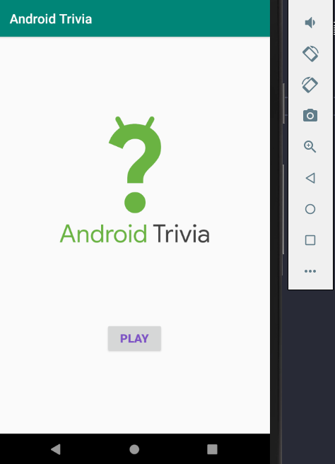
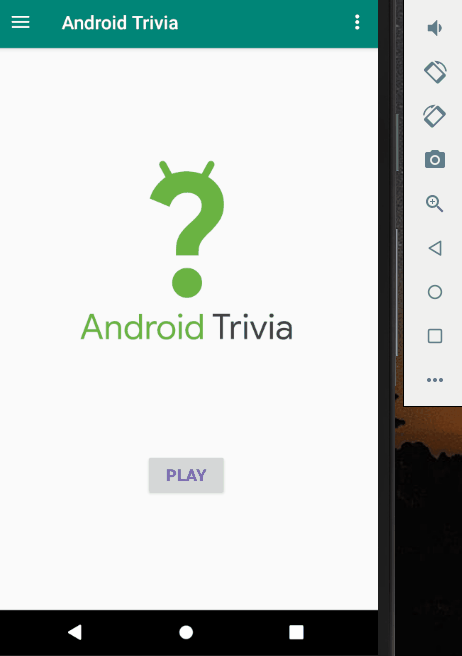

## AndroidTrivia

강의 : https://developer.android.com/codelabs/kotlin-android-training-create-and-add-fragment#0

# 목표

Fragment 를 이용한 퀴즈 앱 만들기

# 1. Create a fragment

TitleFragment 를 만들어 앱 시작 시 띄워준다.

## 결과

[Virtual Device] - Nexus 5X (API LEVEL 30)

# 2. Define navigation paths

강의 : https://developer.android.com/codelabs/kotlin-android-training-add-navigation#0

-  앱 navigation graph 만들기

-  타이틀, 게임화면, 성공화면, 틀린화면 navigation에 추가하기

-  각 화면 연결 후 Play 버튼을 통해 게임 시작

-  앱 상단에 rules, about 메뉴 추가

## 결과

[Virtual Device] - Nexus 5X (API LEVEL 30)

